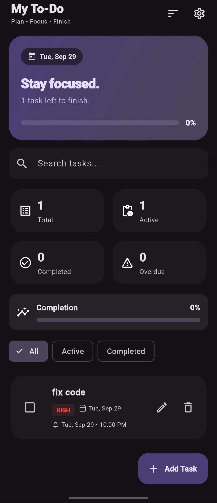
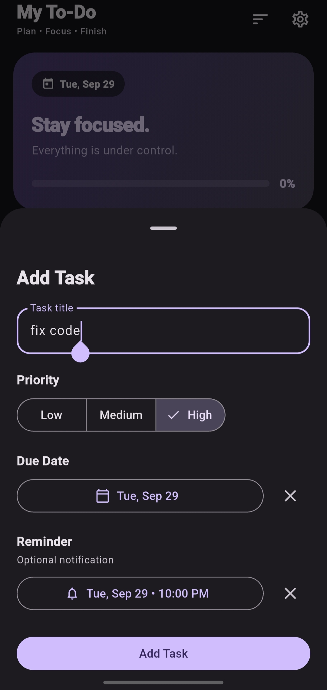
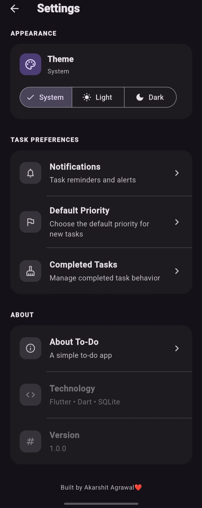

# My To-Do 📋

A simple and modern To-Do application built with **Flutter and Dart**.

The project was created to learn and apply practical Flutter concepts such as local data persistence, notifications, theming, reusable widgets, application structure, testing, and release management.

---

## 📸 Screenshots

| Home | Add Task | Settings |
|---|---|---|
|  |  |  |

---

## ✨ Features

### Task Management

- Create tasks
- Edit tasks
- Delete tasks
- Mark tasks as completed
- Set task priority
  - Low
  - Medium
  - High
- Set due dates
- Set reminder date and time
- Overdue task indication

### Organization

- View all tasks
- Filter active tasks
- Filter completed tasks
- Search tasks
- Sort tasks by:
  - Created order
  - Due date
- View task statistics

### Notifications

- Local task reminders
- Reminder scheduling
- Reminder cancellation when a task is completed or deleted

### Appearance

- System theme
- Light theme
- Dark theme
- Persistent theme preference

### Storage

- Local SQLite database for tasks
- Persistent application preferences

---

## 🛠️ Tech Stack

| Technology | Usage |
|---|---|
| Flutter | Application framework |
| Dart | Programming language |
| Material 3 | UI design |
| SQLite | Local task storage |
| `sqflite` | SQLite integration |
| `shared_preferences` | Persistent preferences |
| `flutter_local_notifications` | Local notifications |
| `timezone` | Reminder scheduling |
| `flutter_timezone` | Device timezone handling |

---

## 📂 Project Structure

```text
my-todo/
│
├── android/              # Android configuration
│
├── lib/
│   ├── models/           # Application data models
│   ├── screens/          # Application screens
│   ├── services/         # Database, preferences, notifications
│   ├── theme/            # Application themes
│   └── widgets/          # Reusable UI components
│
├── test/                 # Flutter tests
├── assets/               # Application assets
├── scripts/              # Development/release scripts
│
├── pubspec.yaml          # Project configuration and dependencies
├── README.md
└── LICENSE
```

---

## 🚀 Getting Started

### Prerequisites

Make sure the following are installed:

* Flutter SDK
* Android Studio
* Android SDK
* Android device or Android Emulator

Verify your Flutter installation:

```bash
flutter doctor
```

---

### 1. Clone the repository

```bash
git clone https://github.com/akarshitcodes/my-todo.git
cd my-todo
```

### 2. Install dependencies

```bash
flutter pub get
```

### 3. Check connected devices

```bash
flutter devices
```

### 4. Run the application

```bash
flutter run
```

---

## 🧑‍💻 Development

During development, Flutter's hot reload can be used for most UI and application changes.

Typical workflow:

```text
Make changes
     ↓
flutter run
     ↓
Test the feature
```

For native Android configuration or certain initialization changes, a full restart may be required.

---

## 🧪 Testing

Run static analysis:

```bash
flutter analyze
```

Run tests:

```bash
flutter test
```

Both should pass before creating a release.

---

## 📦 Build a Release APK

A release APK can be generated using the project's build script:

```bash
./scripts/build_release.sh
```

The script reads the application version from `pubspec.yaml`, builds the release APK, and creates a versioned file such as:

```text
releases/
└── my-to-do-v1.0.0.apk
```

The generated `releases/` directory is kept out of the Git repository.

---

## 🚀 Releases

Versioned APK files are published through **GitHub Releases**.

Example:

```text
Releases
│
├── v1.1.0
│   └── my-to-do-v1.1.0.apk
│
└── v1.0.0
    └── my-to-do-v1.0.0.apk
```

This keeps the source repository clean while providing downloadable versions of the application.

---

## 🛣️ Roadmap

Planned improvements may include:

* Priority-based sorting
* Notification tap navigation
* Dedicated task details screen
* Task categories
* Recurring tasks
* Expanded automated tests
* Improved application architecture
* Optional backend synchronization

The roadmap may change as the project evolves.

---

## 🤝 Contributing

Contributions and suggestions are welcome.

### Contribution workflow

**1. Fork the repository**

Create your own fork of the project on GitHub.

**2. Clone your fork**

```bash
git clone <YOUR_FORK_URL>
cd my-todo
```

**3. Install dependencies**

```bash
flutter pub get
```

**4. Create a feature branch**

```bash
git checkout -b feature/<feature-name>
```

Example:

```bash
git checkout -b feature/task-categories
```

**5. Make your changes**

Run and test the application:

```bash
flutter run
```

**6. Verify your changes**

```bash
flutter analyze
flutter test
```

**7. Commit your changes**

```bash
git add .
git commit -m "Add task categories"
```

**8. Push your branch**

```bash
git push origin feature/task-categories
```

**9. Open a Pull Request**

Create a Pull Request from your fork to the project's `main` branch.

Please keep contributions focused and include relevant details about the changes and testing performed.

---

## 🐛 Issues

If you find a bug or have a feature suggestion, please open an issue and include:

* Device and OS version
* Flutter version
* Steps to reproduce
* Expected behavior
* Actual behavior
* Screenshots or logs when useful

Check your Flutter version with:

```bash
flutter --version
```

---

## 📄 License

This project is licensed under the MIT License.

See the [LICENSE](LICENSE) file for details.

---

## 👨‍💻 Author

**Akarshit Agrawal**

Built with Flutter and Dart as an ongoing learning and open-source project.

---

## ⭐ Support

If you find this project useful or interesting, consider giving the repository a ⭐ on GitHub.

Suggestions, feedback, and contributions are welcome.

